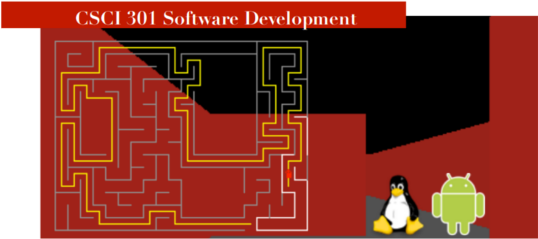

Code for the maze project from my Software Development course. The purpose of this project was to apply topics including object-oriented class design and implementation, abstraction techniques, debugging techniques, defensive programming, development and analysis tools, and testing. The application includes multiple algorithms for generating and solving mazes, as well as a mode for manually navigating mazes.
